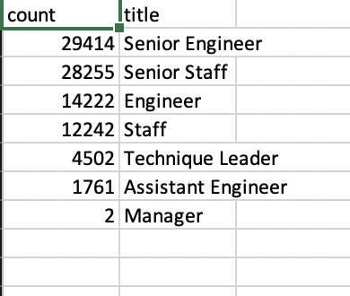
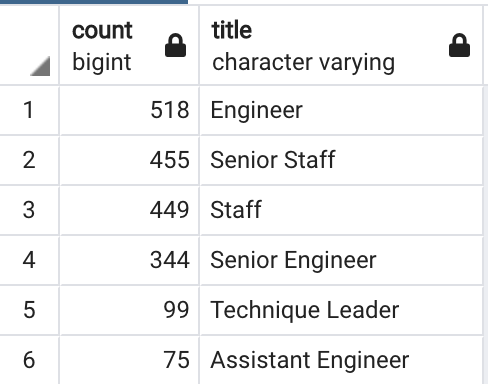
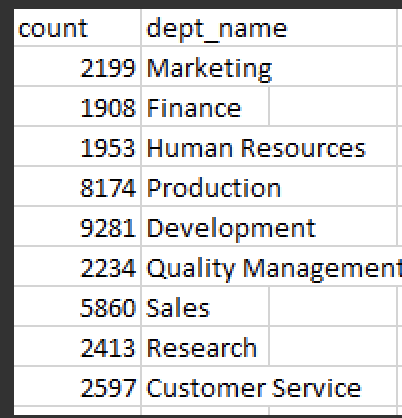

# Pewlett-Hackard-Analysis

# OVERVIEW OF THE ANALYSIS

Pewlett-Hackard hired us to help out one of their employees, Bobby, with reorganizing and analyzing their outdated employee databases to get an idea of  how many of PH’s current employees are going to be eligible for retirement in the very near future. 
 
After our initial analysis was completed, Bobby’s managers tasked us with two more assignments which would require us to further mine our previously created analyses and tables. Those assignments were:

* Determine the number of retiring employees per job title
* Identify employees who are eligible to participate in a mentorship program

# PURPOSE 

The purpose of this analysis is so PH is able to prepare themselves to fill those positions when the “silver tsunami” employees retire and to ensure that there is a seamless transition when the time comes, as those employees who are retiring have critical knowledge of how to their jobs that PH and PH’s new hires will need to ensure their success going forward. 

With our analysis, PH will know the number of retiring employees by their current job title, and the number of potential mentors also by job title. 

# RESOURCES 

## Data Source:
* departments.csv
* dept_emp.csv
* titles.csv

## Software:
* Python 3.6.1
* Pandas
* pgAdmin4
* postgresSQL

# RESULTS
* As requested by PH, we determined the number of retiring employees per job title which can be viewed below. 
* We were also asked to identify employees who are eligible to participate in a mentorship program. We've added a link to view the full analysis. 
* After creating our mentorship eligibility data table, we also took it upon ourselves to create another query in pgAdmin 4 in order to get a potential mentor count by job title to compare with our retiring_titles analysis. 
* We also ran additional queries to determine the number of potential mentors by department.  

## Number of Retiring Employees by Job Title

## Mentorship Eligibility 
[Click here to view our complete mentorship eligibility analysis](/Data/mentorship_eligibility.csv)

## Potential Mentors Count by Job Title

## Number of Potential Mentors by Department 

# SUMMARY
* Identify employees who are eligible to participate in a mentorship program

After completing our analysis, we can see that the number of retiring employees per job title are:
 * Senior Engineers - 29,414
 * Senior Staff - 28,255
 * Engineers - 14,222
 * Staff - 12,242
 * Technique Leaders - 4,502
 * Assistant Engineers - 1,761
 * Managers - 2

This is a grand total of 90,398 roles that will need to be filled. 

1,940
(The summary addresses the two questions and contains two additional queries or tables that may provide more insight)
* How many roles will need to be filled as the "silver tsunami" begins to make an impact?
* Are there enough qualified, retirement-ready employees in the departments to mentor the next generation of Pewlett Hackard employees?
